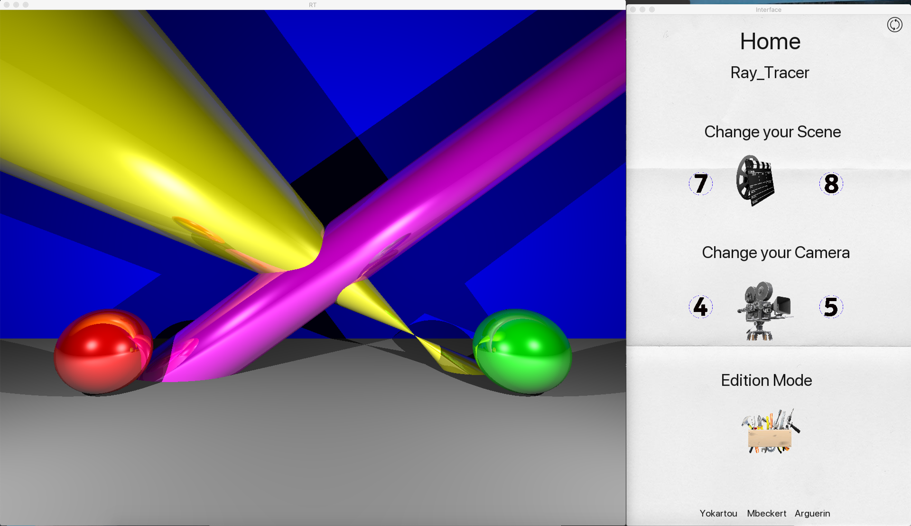
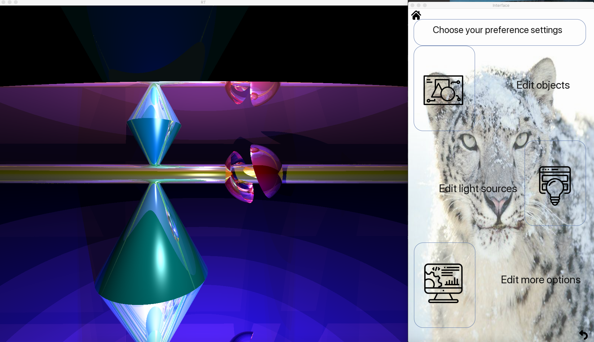
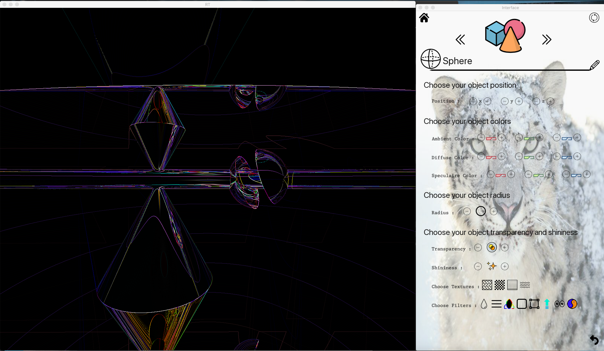

# RT

<i>Graphic programming project</i> 
Program which is generating images according to Raytracing protocol.
 
 
<b>USAGE:</b> 
<i>make coffee</i> 
<i>./rt demo/[file.xml]</i>
 
 
<b>USER GUIDE:</b> 
<i>MOVE CAMERA:</i> A ; Z ; E ; Q ; S ; D ; W ; SHIFT ; CTRL ; ARROWS</b> 
<i>RESTART SCREEN:</i> R</b> 
<i>MUSIC PLAY - STOP:</i> M</b> 
  
<b>EXAMPLES:</b>
 
 
 
 
 
 
 
<b>FEW FUNCTIONALITIES:</b> 
• Objects: plane, sphere, cylinder, disk and cone. 
• Light management: different brightness, shadows. multi-spot, shine effect. 
• Translation and rotation transformation to objects before displaying them. 
• Ambiance light 
• Direct light 
• Bump mapping and color disruption 
• External files for scene description 
• Reflection 
• Transparency 
• Shadow modification according to transparency of the elements 
• Textures 
• Screenshot 
• XML export 
• Interface with object and light management 
• Multithreading 
• ... 
